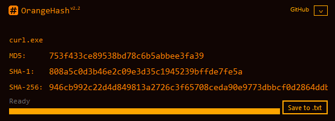

# OrangeHash 🍊 — Windows Hash Viewer (MD5, SHA-1, SHA-256)

[](https://github.com/xcodz/md5-bat/actions)
[](./LICENSE)
[](https://github.com/xcodz/md5-bat/releases)

**OrangeHash** is a lightweight Windows desktop application for quickly viewing file hashes 🎯.  
It supports **MD5, SHA-1, and SHA-256**, runs on Windows 10 and newer, and integrates with File Explorer’s right-click menu.  
A single EXE build is produced for Release (no external DLLs required).

---

## ✨ Features
- 🔑 View **MD5, SHA-1, and SHA-256** at a glance
- 📋 Click any hash to copy it to the clipboard
- 💾 Save button writes `<filename>_hash.txt` next to the file
- 📂 Accepts a file path as the first argument (context menu friendly)
- 🖱 Optional File Explorer context menu entry (“OrangeHash”)
- ⚙️ Optional `md5.bat` shim for launching from CMD (`md5.bat <path>`)

---

## 🖼 Screenshot

```md

```

---

## 📥 Installation

### Option 1 — Installer (Recommended)
- Download **`OrangeHash-Setup.exe`** from [Releases](https://github.com/xcodz/md5-bat/releases).
- During setup you can optionally:
  - Add File Explorer context menu entry (“OrangeHash”).
  - Install `md5.bat` to `System32` to launch from CMD.
- Uninstall removes the app, context menu, and `md5.bat`.

### Option 2 — Portable
- Use the Release build `OrangeHash.exe` (single file). Place it anywhere and run.
- Context menu integration and `md5.bat` are not available in pure portable mode.

**Requirements**
- 🖥 Windows 10 or newer  
- 📦 .NET Framework 4.8 (preinstalled on most Windows 10+ systems)

---

## ▶️ Usage

### File Explorer
- Right-click any file → **OrangeHash**  
  The app opens showing MD5, SHA-1, and SHA-256.

### 🔤 Command Line
If you installed the optional `md5.bat`:

```bat
C:\> md5 abc
900150983cd24fb0d6963f7d28e17f72

C:\> md5 "hello world"
5eb63bbbe01eeed093cb22bb8f5acdc3

C:\> md5 "C:\Windows\notepad.exe"
<file hash here>
```

### Inside the App
- 📋 Click any hash box to copy it to the clipboard.
- 💾 Click **Save** to write `<filename>_hash.txt` next to the source file.
- If launched without an argument, click the “No file provided — click to select” label to choose a file.

---

## 📜 License
Released under the [MIT License](./LICENSE)  
© 2025 Milad Ahmadipour

---

## 🙏 Acknowledgments
- 🖊 Built with **C#** and **WinForms** (.NET Framework 4.8)  
- 📦 **Inno Setup** for packaging  
- ⚡ **Costura.Fody** for single-file embedding  
